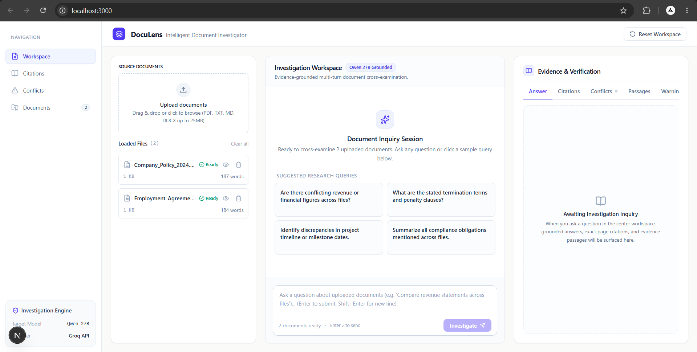
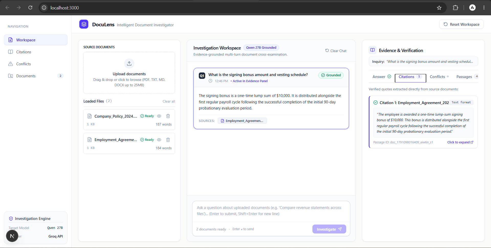
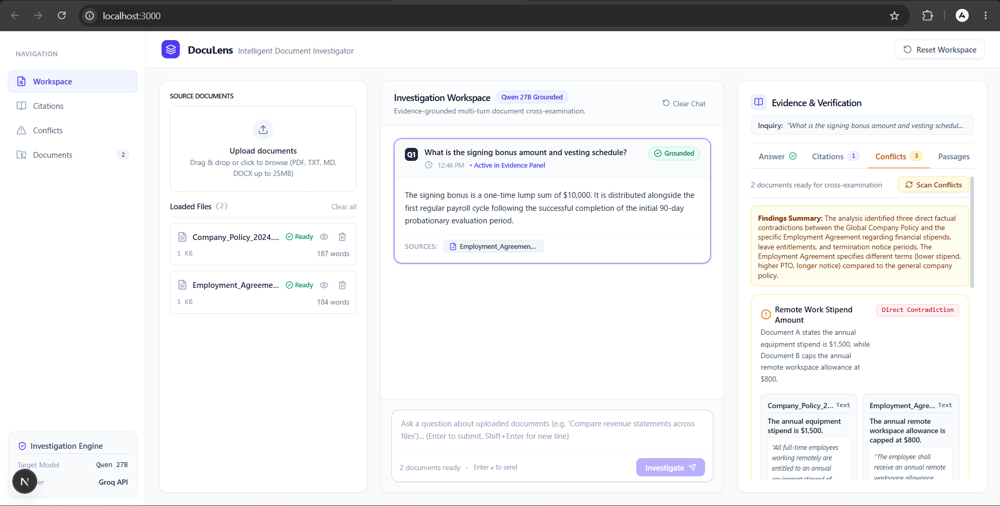
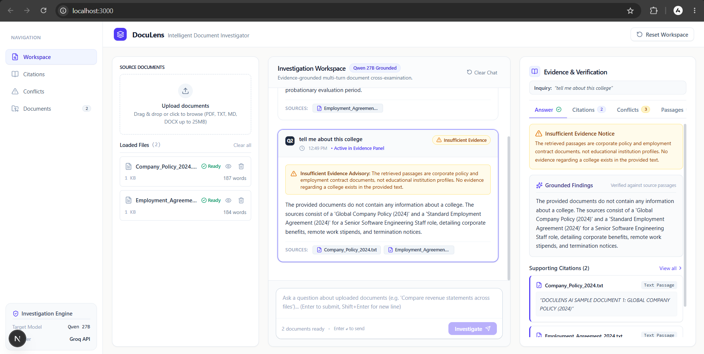
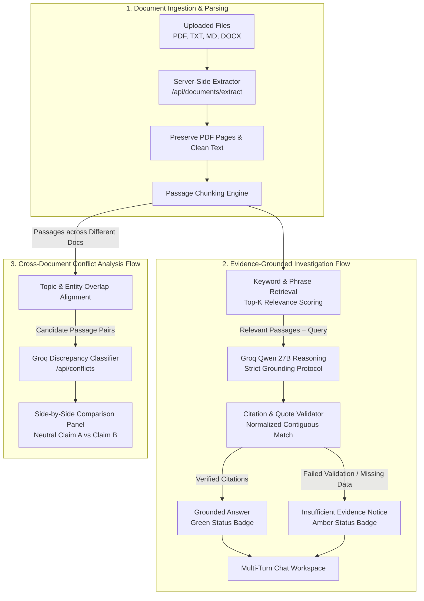

# DocuLens AI — Intelligent Document Investigator

[](https://nextjs.org/)
[](https://www.typescriptlang.org/)
[](https://tailwindcss.com/)
[](https://groq.com/)
[](https://groq.com/)
[](#11-automated-testing-suite)

> **ALGOTHON'26 — Problem Statement: ALG-AI-02 (Intelligent Document Investigator)**  
> An evidence-grounded document analysis engine providing verifiable citations, real page-number tracking, cross-document conflict detection, and multi-turn inquiry history.

---

## 1. Project Overview

**DocuLens AI** is an intelligent document investigation workspace designed for researchers, legal analysts, and auditors. Unlike generic chat-with-PDF wrappers that often hallucinate citations or guess when documents disagree, DocuLens AI enforces strict evidence grounding, verifies extracted source quotes verbatim, detects cross-document contradictions, and flags insufficient evidence.

---

## 2. Problem Statement (ALG-AI-02)

Modern knowledge workers frequently need to synthesize information across multiple documents (contracts, policies, financial disclosures) where:
1. Standard LLMs hallucinate non-existent page numbers or fabricate citations.
2. Contradictory statements (e.g., mismatched revenue figures or termination clauses) go unnoticed.
3. Models generate answers even when the provided documents lack sufficient evidence.

DocuLens AI directly addresses **ALG-AI-02** by implementing an evidence-first investigation pipeline that validates every cited quote against raw source passages and clearly separates grounded facts from unverified claims.

---

## 3. Key Features

- **Multi-Format Document Extraction:** Ingests **PDF**, **TXT**, **MD**, and **DOCX** files up to 25 MB. Preserves 1-indexed page boundaries for PDFs and structured text chunking for text files.
- **Natural-Language Inquiry:** Ask questions in plain English across single or multiple uploaded files simultaneously.
- **Verifiable Citations & Quotes:** Every claim is paired with exact passage excerpts and verified PDF page numbers. Quotes are strictly matched against source text.
- **Cross-Document Conflict Detection:** Automatically aligns passages discussing similar topics, dates, or figures across different documents, classifying discrepancies into *Direct Contradiction* or *Possible Conflict (Review)* side-by-side.
- **Insufficient Evidence Warnings:** Displays an explicit amber status banner when documents do not contain enough verified evidence to answer conclusively.
- **Multi-Turn Investigation History:** A conversation-based chat workspace where each inquiry preserves its own isolated citations and evidence panel state.

---

## 4. Application Screenshots

### 1. Main Investigation Workspace & Document Vault

*The three-column editorial research interface featuring the source document vault on the left, the multi-turn conversational inquiry workspace in the center, and the evidence & verification panel on the right.*

### 2. Evidence-Grounded Question Answering

*Grounded response generated by Groq Qwen 27B displaying verified source citations, clickable document reference chips, and traceable PDF page numbers.*

### 3. Cross-Document Conflict Detection

*Automated cross-document contradiction detection presenting conflicting claims from multiple documents side-by-side with verbatim excerpts and source attribution.*

### 4. Insufficient Evidence Safeguards

*Truthful handling of out-of-scope or unanswerable queries displaying an amber advisory banner and status badge when supporting evidence is missing.*

---

## 5. Architecture Diagram



---

## 6. Technology Stack

| Technology | Version | Purpose in Repository |
| :--- | :--- | :--- |
| **Next.js** | `16.3.8` | App Router framework, server-side API routes, Turbopack compiler |
| **React** | `19.2.8` | Frontend UI components, state management |
| **TypeScript** | `^5` | Strict static typing across models, API contracts, and components |
| **Tailwind CSS** | `^4` | Editorial research styling system and responsive layout |
| **Groq API** | Cloud SDK / REST | Fast server-side LLM inference (`qwen/qwen3.8-27b`) |
| **unpdf** | `^1.8.1` | Server-side PDF text extraction and page boundary parsing |
| **mammoth** | `^1.13.0` | Server-side `.docx` Microsoft Word document text extraction |
| **lucide-react** | `^1.51.0` | Interface iconography |
| **node:test** | Built-in | Deterministic unit and integration test runner |

---

## 7. Prerequisites & Local Installation

### Prerequisites
- **Node.js**: Version `18.18.0` or higher (Node 20+ recommended)
- **npm**: Version `9.0.0` or higher
- **Groq API Key**: Obtain a free API key from [Groq Console](https://console.groq.com)

### Installation Steps

```bash
# 1. Clone the repository
git clone https://github.com/amanshu999/DocuLens.git
cd DocuLens

# 2. Install dependencies
npm install
```

---

## 8. Environment Variable Setup

Create a `.env.local` file in the root directory:

```bash
# Required: Server-side Groq API key (Never exposed to the client)
GROQ_API_KEY=gsk_your_actual_groq_api_key_here

# Optional: Preferred model (defaults to qwen/qwen3.8-27b)
GROQ_MODEL=qwen/qwen3.8-27b
```

> **Security Note:** All Groq API calls are executed strictly server-side in Next.js Route Handlers. `.env*` files are excluded in `.gitignore` and are never exposed to client bundles or browser consoles.

---

## 9. Available Commands

Run the scripts defined in `package.json`:

```bash
# Start local development server (http://localhost:3000)
npm run dev

# Run automated test suite (31 deterministic tests)
npm test

# Run ESLint validation
npm run lint

# Compile production build
npm run build

# Start production server
npm start
```

---

## 10. Citation Verification & Uncertainty Safeguards

DocuLens AI implements a multi-layered verification system to prevent false claims:

1. **Page Number Integrity:** Real 1-indexed page boundaries are preserved for PDFs. TXT, MD, and DOCX files maintain `pageNumber: undefined` to prevent fabricated page numbers.
2. **Passage Whitelisting:** Citations reference verified internal passage IDs. Any citation referencing an invalid or non-existent passage ID is rejected.
3. **Normalized Contiguous Quote Verification:** The `normalizeForMatch` function validates quoted text against the raw passage text. If a model alters numbers, dates, or wording in an excerpt, the citation is discarded.
4. **Truthful Status Derivation:** The `resolveInvestigationStatus` utility inspects the actual outcome:
   - **Grounded (Green):** Only when the answer has verified supporting citations and no insufficiency flags.
   - **Insufficient Evidence (Amber):** When no matching passages exist, the model reports missing context, or all candidate citations fail quote verification.
   - **Failed (Red):** When an API error or network exception occurs, enabling a one-click retry.

---

## 11. Known Limitations

- **Keyword Retrieval Scope:** Passage retrieval uses transparent keyword frequency and multi-word phrase matching (top-K = 6). Passages with non-overlapping vocabulary or purely semantic synonyms may not be ranked in top-K passages.
- **Synthesis Nuance:** While supporting quotations and page numbers are strictly verified, high-level synthesized summaries rely on LLM language generation. Users should inspect the raw cited passages in the Evidence panel.
- **Heuristic Conflict Alignment:** The two-stage conflict detector aligns candidate passages based on shared entities, metrics, and topics before invoking Groq to optimize latency and token costs.

---

## 12. Automated Testing Suite

The repository contains **31 automated deterministic tests** executed via `npm test`:

```text
> node --test tests/extractor.test.mjs tests/investigate.test.mjs tests/conflicts.test.mjs

✔ 6 Candidate Alignment & Cross-Document Conflict Tests passed
✔ 10 PDF, TXT, MD, and DOCX Text Extractor Tests passed
✔ 15 Passage Retrieval, Citation Validation, Groq Safety & Status Resolver Tests passed
ℹ tests 31
ℹ pass 31
ℹ fail 0
```

### Test Coverage Breakdown:
- **`tests/extractor.test.mjs` (10 tests):** PDF page boundary preservation, TXT/MD extraction, DOCX extraction, oversized file rejection (>25MB), empty file handling, corrupt PDF/DOCX handling.
- **`tests/investigate.test.mjs` (15 tests):** Keyword extraction, passage retrieval scoring, legitimate citation validation, rejection of fabricated passage IDs, rejection of altered quotes, missing API key handling, empty retrieval handling, and status derivation tests (Grounded, Insufficient Evidence, Error).
- **`tests/conflicts.test.mjs` (6 tests):** Topic alignment across different files, prevention of self-document pairing, conflict claim quote verification, and safety fallbacks.

---

## 13. Responsible AI & Disclosure

- **AI Model:** Powered by `qwen/qwen3.8-27b` via Groq's high-speed LPU inference API.
- **Data Privacy:** Documents are processed ephemerally in server-side memory. No document contents or embeddings are stored in third-party vector databases.
- **Editorial Neutrality:** When cross-document conflicts are detected, both sides (Claim A and Claim B) are presented neutrally with source citations. The system does not decide which document is authoritative.
- **Development Disclosure:** Developed using AI-assisted pair programming and deterministic test-driven development for ALGOTHON'26.

---

## 14. Judge Demo Workflow

To verify DocuLens AI during hackathon evaluation:

1. **Upload Test Documents:**
   - In the left **Source Documents** panel, upload a PDF (e.g. quarterly report) and a TXT/DOCX file. Observe real-time page count and character extraction.
2. **Ask a Grounded Inquiry:**
   - Type a question related to the text (or click a sample query) and press **Enter**.
   - Observe the question added to the conversation history, the input clearing, and the green **Grounded** response appearing with clickable citation tags.
3. **Inspect Citations in Evidence Panel:**
   - Click a citation chip in the response or switch tabs in the right **Evidence & Verification** panel. Inspect the exact page number and verbatim quote in the inspection modal.
4. **Test Insufficient Evidence Handling:**
   - Ask an unrelated question (e.g., *"What is the rocket launch schedule?"*).
   - Observe the amber **Insufficient Evidence** badge and notice explaining that the files lack matching data.
5. **Cross-Document Conflict Detection:**
   - Upload two files with differing policies/dates.
   - Open the **Conflicts** tab and click **"Scan Conflicts"**.
   - Review the side-by-side comparison displaying Claim A and Claim B with source citations.

---

## 📄 License & Attribution

Built for **ALGOTHON'26 — Problem Statement ALG-AI-02**.  
All rights reserved by the repository owner.
